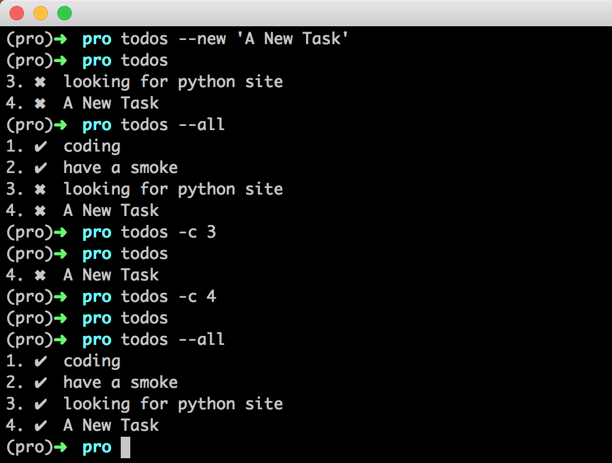

# Todo.py
Command line lightweight todo tool with readable storage , written in Py.

## Installation
`pip install todos`

## Usage
0. `todos` to show all waiting todos
0. `todos --use <name>` to change todo file to stroe
0. `todos --all` to show all todos
0. `todos -n <text>` to new a todo
0. `todos -c <1,2..>` to mark these todos done
0. `todos -r <1,2..>` to remove these todos from file
0. `todos --clear` to cleat all todos, will confirm

